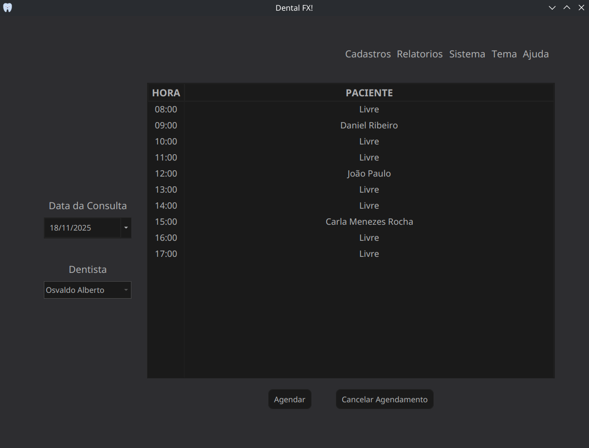
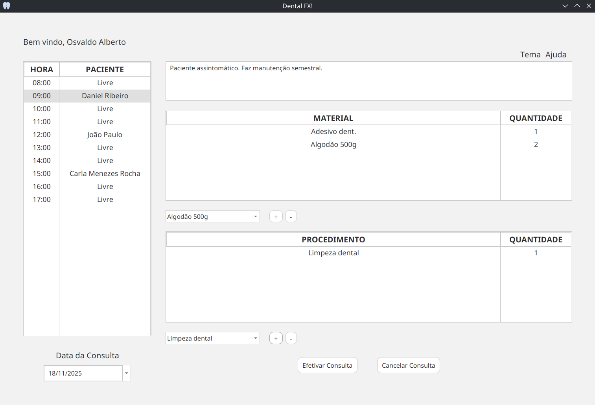
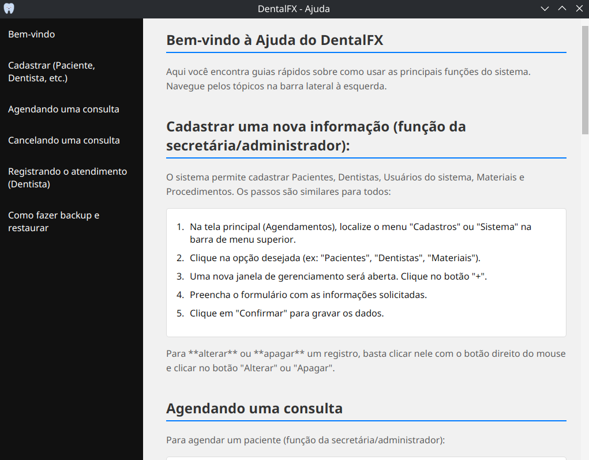

## 🦷 DentalFX

💻 **Disciplina:** Ferramentas Computacionais II  
📚 **Curso:** Ciência da Computação — FIPP / UNOESTE  
👨‍💻 **Autor:** Matheus Oliveira da Silva  

---

### 📖 Sobre o Projeto

O **DentalFX** é um sistema desktop desenvolvido em **Java** com interface gráfica em **JavaFX**, destinado a informatizar e otimizar a gestão de clínicas odontológicas.

O objetivo principal é integrar o processo de agendamento de consultas, o acompanhamento dos atendimentos por dentista com registro de procedimentos e materiais gastos,  a gestão de cadastros essenciais (Pacientes, Dentistas, Procedimentos e Materiais).

---

### 🎯 Objetivos

- **Interface Intuitiva:** Desenvolver uma interface gráfica moderna e responsiva utilizando os recursos do **JavaFX**.
- **Gestão de Agendas:** Implementar agendas individuais para cada **dentista**, permitindo agendamentos nos horários definidos (8h00 às 18h00, em intervalos de 1 hora).
- **Controle de Acesso:** Implementar um sistema de perfis de usuário com três **níveis de acesso** (Irrestrito, Cadastros/Agendamentos e Dentista).
- **Rastreio Clínico:** Permitir que o dentista registre detalhadamente o **relato do atendimento** e os **procedimentos** e **materiais** consumidos na consulta.
- **Relatórios:** Gerar **relatórios operacionais** (listas básicas) e **analíticos** (atendimentos por data/dentista).

---

### ⚙️ Funcionalidades Principais

- 🔹 **Cadastros de Base:** CRUD completo para as entidades Material, Procedimento, Dentista, Paciente e Usuário (Apenas administrador).
- 🔹 **Gestão de Agendamentos:** Registro e exclusão de consultas para um determinado paciente e um determinado dentista.
- 🔹 **Acompanhamento Clínico (Dentista):** Acompanhamento da consulta pelo dentista registrando o relato do atendimento e os Materiais e Procedimentos utilizados.
- 🔹 **Relatórios e Fichas:** Emissão de relatórios básicos (Lista de materiais, pacientes, procedimentos e agenda do dia), relatórios analíticos (atendimentos realizados por um dentista em um determinado período) e fichas de paciente (dados cadastrais e histórico de atendimento).
- 🔹 **Níveis de Usuário:** Controle de acesso baseado em níveis para garantir a segurança e a separação de responsabilidades.
- 🔹 **MVC:** Arquitetura MVC **(Model-View-Controller)** para separar a lógica de negócios da interface gráfica, garantindo a manutenibilidade do código.
- 🔹 **Ajuda:** WebView com manual de referência oferecendo suporte para as operações do sistema.

---

### 📅 Agendamento de Consulta

---

### 📋 Acompanhamento de Consulta

---

### ❓ Ajuda

